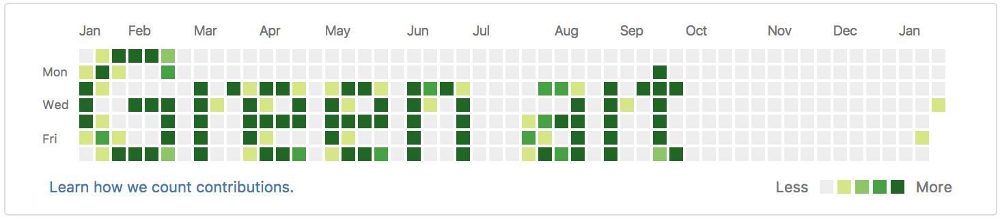

# Greenart



Greenart draws image on your github green panel

## Installation

```bash
pip3 install greenart
```

## Usage

1. Clone this repo

```bash
git clone https://github.com/seregayoga/greenart.git
```

2. Change dir to repo

```bash
cd ./greenart
```

3. Create your own repo with any name, for example `yourrepo`

4. Change origin

```bash
git remote set-url origin git@github.com:yourname/yourrepo.git
```

5. Run

```bash
greenart examples/greenart.png | bash
```

Instead of `examples/greenart.png` can be any image that scales to github activity panel

## Testing

```bash
$ pip install -r requirements-dev.txt
$ nosetests -v

Test Image.get_commands method ... ok
Test Image._get_commit_from_past method ... ok
Test Image._get_days_ago_when_was_first_sunday method ... ok
Test Image._get_github_color_from_grey method ... ok

----------------------------------------------------------------------
Ran 4 tests in 0.038s

OK
```
